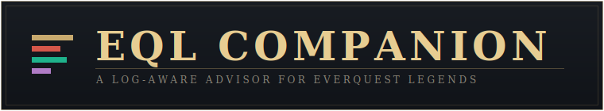
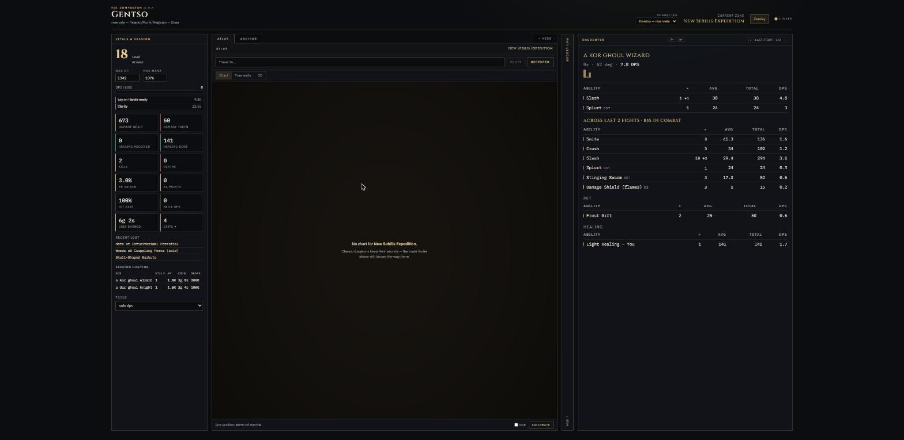
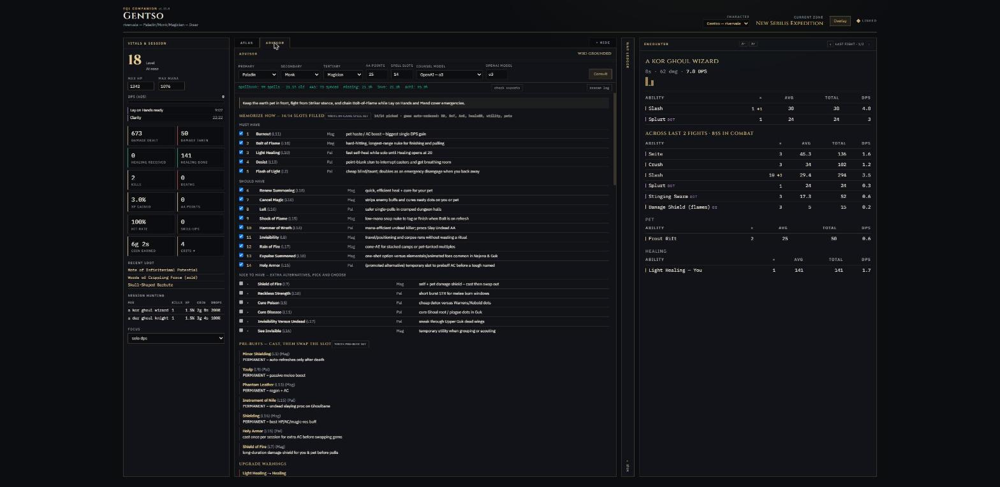
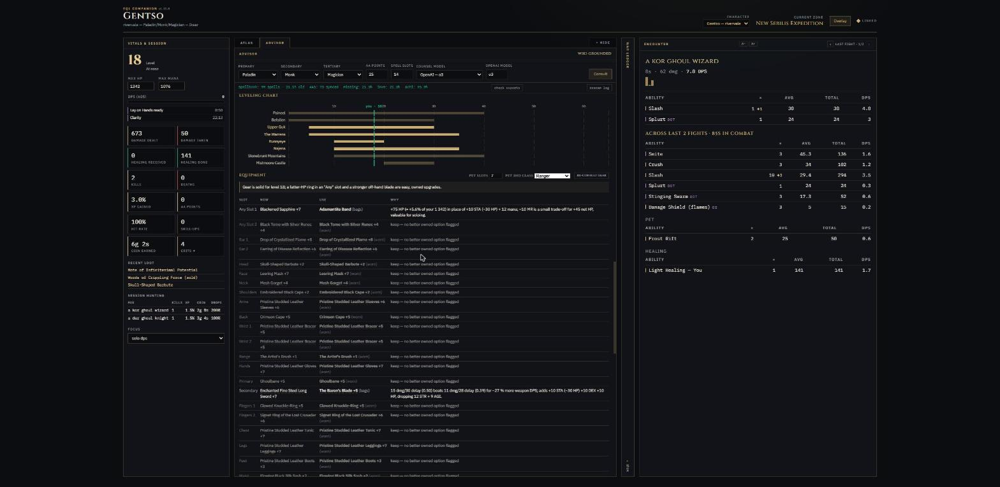
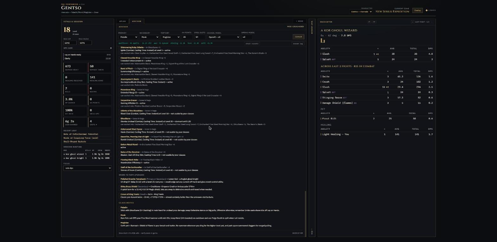
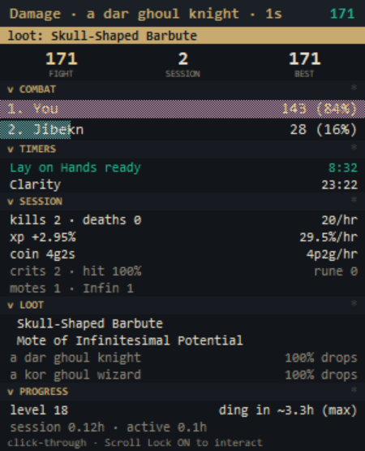

<p align="center">
  
</p>

A real-time companion app for **EverQuest Legends**. It tails your combat log
and gives you a live HUD in the browser — nothing injected, nothing touching
the game process. The one thing it can write is optional: recommended spell
sets into your character's saved-loadout file (with a backup), so one
in-game `/memspellset companion` loads the whole advised bar.

## In action

**The HUD** — live vitals with per-hour rates and countdown timers, the
fight breakdown with per-ability crits, your pet's contribution, and
observed drop rates per mob:



**The Advisor** — a wiki-grounded spell loadout for your exact trio and
level, with one-click write-back into the game's saved spell sets, and
permanent pre-buffs called out so you never waste a slot:



**Gear counsel** — every recommendation shows real stats scaled to your
items' upgrade ranks (a +75 HP swap is framed as a percentage of YOUR
hit points), above a community-rated leveling chart:



**Exaltations** — every stone you own: what it grants, whether it's
active or dormant, and exactly which of your items it can legally
socket into — plus where to farm your next upgrades:



**The in-game overlay** — a compact always-on-top meter that lives
over the game: ranked damage bars, spell/cooldown timers, session
rates, drop tracking, and loot/kill alerts with an attention banner.
Click-through by default; Scroll Lock makes it interactive:

<p align="center"></p>

**What you get**

- **Vitals & War Ledger** — live DPS, session stats, hit rate, XP, loot
  (with sold tags), a streaming combat feed, per-pull encounter breakdowns
  with group/raid DPS and a defense line (dodge/parry/block/riposte)
- **Combat dashboard** — hide the Atlas/Advisor panel and the encounter view
  spreads across the freed width; the ledger collapses to a strip;
  encounter text size is adjustable
- **Atlas** — zone charts with a live position dot, zone-to-zone routing,
  "true walls" mined from the game's own map geometry, and a textured 3D
  dollhouse view with a follow camera
- **Advisor** — spell loadout with pick-and-choose checkboxes, AA spending,
  upgrade warnings, a vendor shopping list, gear-slot recommendations,
  exaltation tracking (typed sockets), and where-to-hunt picks — grounded in
  your actual spellbook/inventory exports and the EQL wiki, with every
  suggestion machine-verified (owned, level-legal, not superseded).
  One click writes the picks as in-game spell sets — a combat loadout
  (gems auto-ordered: DD, DoTs, AoE, heals at gem 8, utility, pets) and a
  pre-buff set (permanent buffs first, then longest-duration)
- **Overlay** — a Details-style damage meter over the game: ranked
  class-colored bars up to raid size, damage/DPS modes, this-fight or
  last-5-fights segments; closes itself when the game exits

## Requirements

- **Windows 10/11** (log tailing works anywhere, but OCR position tracking
  and the overlay are Windows-only)
- **Python 3.11+**
- **Node.js 18+** (serves the web UI)
- EverQuest Legends with logging enabled (type `/log on` in game once)

**Optional — pick zero or one LLM for reasoned counsel:**

| Option | Needs | Notes |
|---|---|---|
| None (deterministic) | nothing | default-ready; mechanical but honest counsel, instant |
| LM Studio | a local model | free, private; ~26B MoE models work well |
| OpenAI | an API key | best quality; a consult is ~7k tokens |
| Custom endpoint | any OpenAI-compatible URL | Groq / OpenRouter / Gemini compat / LAN — free tiers work |

**Optional — EQL MCP server** ([ArtSabintsev/everquest-legends-mcp](https://github.com/ArtSabintsev/everquest-legends-mcp),
Node 22+) for structured spell/AA data. Without it the app fetches the wiki
over plain HTTP automatically — no Node beyond the UI is required.

## Setup — the easy way

> Never installed anything like this before? **[INSTALL.md](INSTALL.md)**
> walks through every click — no git or command line knowledge needed
> (download the ZIP, extract, run `install_companion.bat`).

```
git clone https://github.com/EKirschmann/eql_companion
cd eql_companion
install_companion.bat
```

No git? Download the newest **Source code (zip)** from the
[releases page](https://github.com/EKirschmann/eql_companion/releases),
extract, run `install_companion.bat`.

The installer pulls dependencies, then a short wizard finds your EverQuest
Legends install (scans all drives; or paste the path), offers to download
the [Brewall map pack](https://www.eqmaps.info/eq-map-files/) for the 2D
Atlas charts (the 3D view mines the game's own files — nothing to download),
and asks which counsel model to use — including **none**. Every answer just
fills in `.env`; change any of it later by editing that file, or re-run
`python setup_wizard.py`.

## Setup — by hand

```
pip install -r requirements.txt
cd frontend && npm install && cd ..
copy .env.example .env
```

You usually do NOT need to set `EQL_GAME_DIR`: the backend tries the
launcher's standard path and then the game's own registry entry, so even
custom installs are found automatically (logs and maps derive from it).
Set it in `.env` only when detection fails. Optional 2D dungeon charts:
extract the Brewall pack from
<https://www.eqmaps.info/eq-map-files/> into `<game dir>\maps\Dark Brewall`.

## Run

`start_companion.bat` — or two terminals:

```
uvicorn backend.main:app --reload     # backend on :8000
cd frontend && npm run dev            # UI on :3000
```

Open **http://localhost:3000**, then in game type:

| Command | Why |
|---|---|
| `/log on` | start writing the combat log (once per character) |
| `/who` | teaches the app your level + class trio |
| `/outputfile spellbook` · `inventory` · `missingspells` | grounds the Advisor in what you own |
| `/alternateadv list` | syncs your AA ranks |
| `/loc` | drops a position fix on the Atlas (or enable OCR tracking) |

Then press **check exports** and **Consult** in the Advisor tab.

## Updating

Click the version badge in the app header to check for a newer release.
To update: close the companion, run `update_companion.bat`, start it again —
works for both git clones (pull) and ZIP installs (a built-in downloader;
git is never required). What changed is in [CHANGELOG.md](CHANGELOG.md).

## Notes

- Sessions survive backend restarts (state snapshots to `data/`)
- One active character at a time; the header dropdown switches between every
  `eqlog_*.txt` in the folder
- Everything stays local: logs, exports, and counsel never leave your machine
  unless you point the LLM at a hosted API
- Full architecture and extension docs: `CLAUDE.md`
